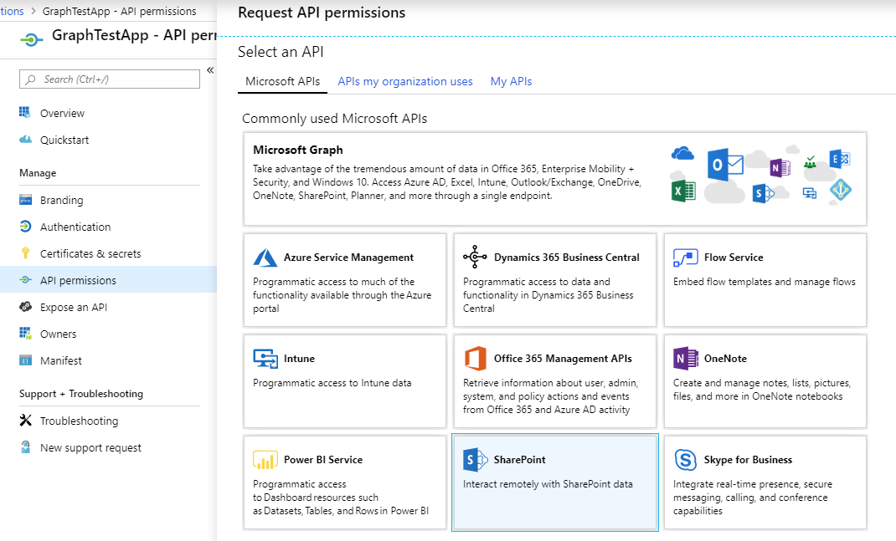

# ChangeLog sample

1. Register an application in [Azure AD portal](https://aad.portal.azure.com)

1. Choose **SharePoint** in **API Permissions**

	

1. Update `appSettings.json` (or the User Secrets file) with information about your tenant/application.