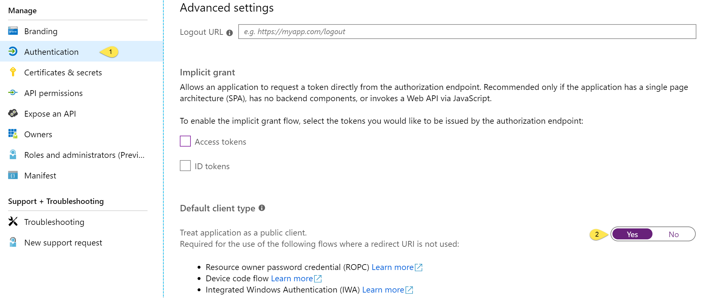
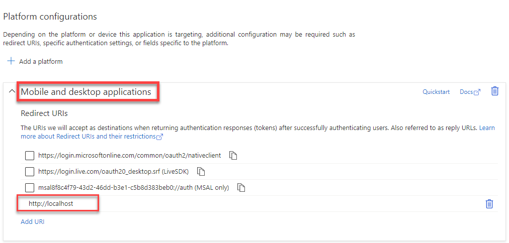
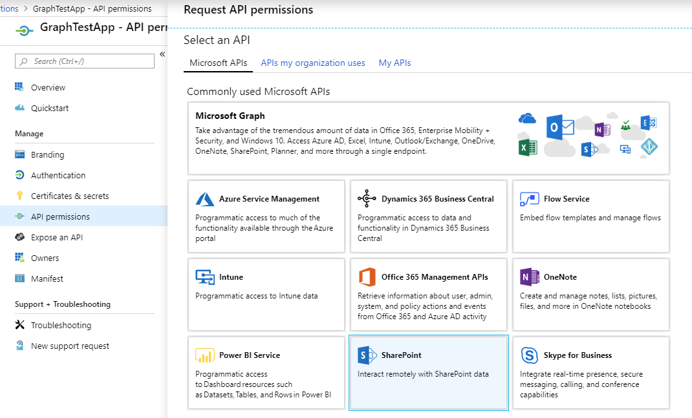

# Graph.Community Samples

The samples are implemented is separate classes. Each class uses common utility classes to manage configuration options and Http Request/Response logging.

The samples will require an application registration in [Azure Active Directory](https://aad.portal.azure.com). When creating the registration, select the option to treat the application as a public client.

To configure the sample to use the the interactive login, ensure that the Mobile and Desktop Applications platform is added, and the Redirect URI is set to `http://localhost`.

Older samples use the [Device Code flow](https://aka.ms/msal-net-device-code-flow).

Refer to the notes below for the scopes required for each sample.

## Diagnostics sample

The diagnostics sample demonstrates how to capture diagnostic information from MSAL, diagnostics from the Graph.Community libary and use the LoggingMiddleware handler. The diagnostic sample also leverages the CommunityGraphClientFactory to properly setup the middleware handlers.

## SiteGroups sample and Interactive Login with token cache

This sample will enumerate all the SiteGroups in the site, and the SiteUsers in each group.

Specify the site in the `SiteGroups.cs` file.

> **Scopes required**: https://[SharePointDomain].sharepoint.com/AllSites.FullControl
> (Replace [SharePointDomain] with the value for your tenant.)
 
To add a scope for SharePoint, choose **SharePoint** in **API Permissions**

## Outlook Immutable IDs sample

This sample will read the messages in the current user's mailbox, once without the `Prefer` header and a second time with the header. The ID of the first message is displayed in both instances.
 
> **Scopes required**: https://graph.microsoft.com/Mail.Read
 
## SharePoint ChangeLog sample

> The functionality provided by the SharePoint ChangeLog is also available using Microsoft Graph + Delta query. More information is provided in this Tech Community Post: [How to retrieve complete set of permission changes while utilizing DeltaLinks (tokens) in SPO?](https://techcommunity.microsoft.com/t5/microsoft-sharepoint-blog/how-to-retrieve-complete-set-of-permission-changes-while/ba-p/1741127)

This sample will query the specified site (SP.Web), retrieving the current change token. The application will then pause, allowing for the user to update something in the site. Upon resuming, the application will retrieve all changes since the initial query.

Specify the site in the `ChangeLog.cs` file.

> **Scopes required**: https://[SharePointDomain].sharepoint.com/AllSites.FullControl
> (Replace [SharePointDomain] with the value for your tenant.)
 
To add a scope for SharePoint, choose **SharePoint** in **API Permissions**

## SharePoint SiteDesign sample

This sample will create a new Site Script, a new Site Design and apply that design to the specified site (SP.Site).

Specify the site in the `SiteDesign.cs` file.

> **Scopes required**: https://[SharePointDomain].sharepoint.com/AllSites.FullControl
> (Replace [SharePointDomain] with the value for your tenant.)
 
To add a scope for SharePoint, choose **SharePoint** in **API Permissions**

